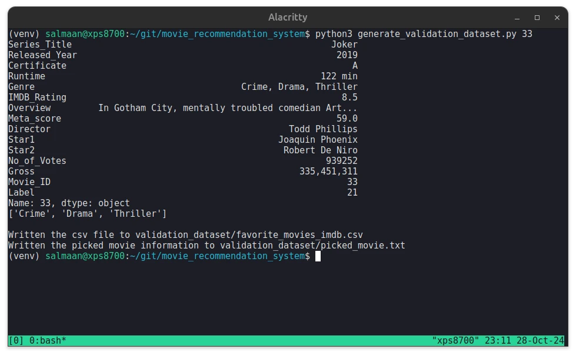
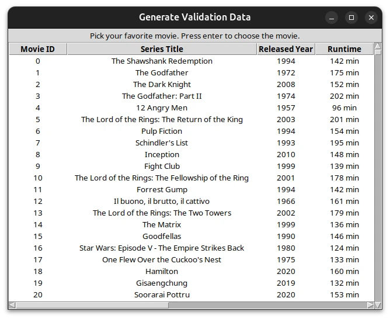

# movie_recommendation_system
Movie recommendation system written in Python with PyTorch.






## Source of the IMDB Movies Dataset
[IMDB Movies Dataset - Top 1000 Movies by IMDB Rating - kaggle](https://www.kaggle.com/datasets/harshitshankhdhar/imdb-dataset-of-top-1000-movies-and-tv-shows)

## Usage Instructions

### 1. Generate the Dataset
1.1 Generate the dataset from the original dataset:
```
python3 generate_dataset.py
```

### 2. Generate the Training and Validation Datasets
2.1 Generate the training and validation datasets:
```
python3 generate_training_validation_datasets.py
```

### 3. Train a Model
3.1 Start TensorBoard to provide the visualization required
to check how well the trained model did:
```
tensorboard --logdir=runs
```

3.2 Train a model:
```
python3 train_model.py
```

### 4. Generate Personalized Dataset
4.1 Create a personalized dataset with the index of the row of the movie entry:
```
python3 generate_personalized_dataset.py 33
```

or

Use the GUI program to create a personalized dataset by choosing a movie entry:
```
python3 gui_generate_personalized_dataset.py
```

### 5. Run Program
5.1 Run the program with the file path of the saved model:
```
python3 main.py trained_models/model_20241103_222757_184.pt
```

- The file name format of the saved models:
  - model_\<timestamp\>_\<epoch_number\>.pt"
- The timestamp format:
  - %Y%m%d_%H%M%S

**Note**: It is a good idea to pick a model with the highest number of epochs.

## Accuracy of the Model

A user chooses this as their favorite movie:
- Movie_ID: 33
- Series_Title: Joker
- Released_Year: 2019
- Certificate: A
- Runtime: 122 min
- Genre: Crime, Drama, Thriller
- IMDB_Rating: 8.5
- Overview: In Gotham City, mentally troubled comedian Arthur Fleck is
disregarded and mistreated by society. He then embarks on a downward
spiral of revolution and bloody crime. This path brings him face-to-face
with his alter-ego: the Joker.
- Meta_score: 59.0
- Director: Todd Phillips
- Star1: Joaquin Phoenix
- Star2: Robert De Niro
- No_of_Votes: 939252
- Gross: 335451311.0

### 1. Result
Here is the result after running the movie recommendation program 100 times:
- Accuracy of the movie recommendations: 83%

**Note**: The `measure_accuracy.py` script runs the program 100 times for me.

The accuracy of the model is 83%. There is certainly more work that has to be
done to get it to a 90% accuracy. An accuracy above 75% is pretty good for a
demo project.

## Resource
- [PyTorch Website](https://pytorch.org)
- Introduction to PyTorch
  - [Learn the Basics](https://pytorch.org/tutorials/beginner/basics/intro.html)
  - [Quickstart](https://pytorch.org/tutorials/beginner/basics/quickstart_tutorial.html)
  - [Tensors](https://pytorch.org/tutorials/beginner/basics/tensorqs_tutorial.html)
  - [Datasets & DataLoaders](https://pytorch.org/tutorials/beginner/basics/data_tutorial.html)
  - [Build the Neural Network](https://pytorch.org/tutorials/beginner/basics/buildmodel_tutorial.html)
  - [Optimizing Model Parameters](https://pytorch.org/tutorials/beginner/basics/optimization_tutorial.html)
- Introduction to PyTorch on YouTube
  - [Introduction to PyTorch - YouTube Series](https://pytorch.org/tutorials/beginner/introyt.html)
  - [Introduction to PyTorch](https://pytorch.org/tutorials/beginner/introyt/introyt1_tutorial.html)
  - [Introduction to PyTorch Tensors](https://pytorch.org/tutorials/beginner/introyt/tensors_deeper_tutorial.html)
  - [The Fundamentals of Autograd](https://pytorch.org/tutorials/beginner/introyt/autogradyt_tutorial.html)
  - [Building Models with PyTorch](https://pytorch.org/tutorials/beginner/introyt/modelsyt_tutorial.html)
  - [PyTorch TensorBoard Support](https://pytorch.org/tutorials/beginner/introyt/tensorboardyt_tutorial.html)
  - [Training with PyTorch](https://pytorch.org/tutorials/beginner/introyt/trainingyt.html)
  - [Model Understanding with Captum](https://pytorch.org/tutorials/beginner/introyt/captumyt.html)
- [Nesterov Momentum Explained with examples in TensorFlow and PyTorch - Medium](https://medium.com/@giorgio.martinez1926/nesterov-momentum-explained-with-examples-in-tensorflow-and-pytorch-4673dbf21998)
- [Pytorch Change the learning rate based on number of epochs - StackOverflow](https://stackoverflow.com/questions/60050586/pytorch-change-the-learning-rate-based-on-number-of-epochs)
- [How to split data into 3 sets (train, validation and test)? - StackOverflow](https://stackoverflow.com/questions/38250710/how-to-split-data-into-3-sets-train-validation-and-test)
