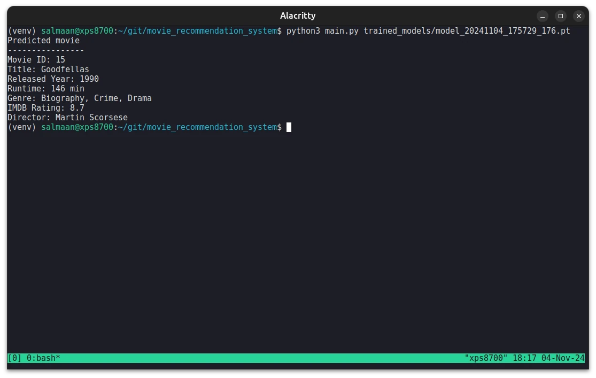

# movie_recommendation_system
Movie recommendation system written in Python with PyTorch.




## Source of the IMDB Movies Dataset
[IMDB Movies Dataset - kaggle](https://www.kaggle.com/datasets/harshitshankhdhar/imdb-dataset-of-top-1000-movies-and-tv-shows)

## Usage Instructions
### 1. Create Validation Data
1.1 Create a validation data with the index of the row:
```
python3 generate_validation_data.py 33
```

### 2. Train a Model
2.1 Make sure to create the `trained_models` directory before training a model:
```
mkdir trained_models
```

2.2 Start TensorBoard:
```
tensorboard --logdir=runs
```

2.3 Train a model:
```
python3 train_model.py
```

### 3. Run Program
3.1 Run the program with the file path of the model:
```
python3 main.py trained_models/model_20241017_124650_93.pt
```

**Note**: It is a good idea to pick a model with the highest number of epochs.

## Accuracy of the Model

A user chooses this as their favorite movie:
- Movie_ID: 33
- Series_Title: Joker
- Released_Year: 2019
- Certificate: A
- Runtime: 122 min
- Genre: Crime, Drama, Thriller
- IMDB_Rating: 8.5
- Overview: In Gotham City, mentally troubled comedian Arthur Fleck is
disregarded and mistreated by society. He then embarks on a downward
spiral of revolution and bloody crime. This path brings him face-to-face
with his alter-ego: the Joker.
- Meta_score: 59.0
- Director: Todd Phillips
- Star1: Joaquin Phoenix
- Star2: Robert De Niro
- No_of_Votes: 939252
- Gross: 335451311.0

### 1. Result
Here is the result after running the movie recommendation program 100 times:
- Accuracy of the recommendations: 81%

**Note**: The `measure_accuracy.py` script runs the program 100 times for me.

The accuracy of the model is 81%. There is certainly more work that has to be
done to get it to a 90% accuracy. An accuracy above 75% is pretty good for a demo
project.

## Resource
- [PyTorch Website](https://pytorch.org)
- Introduction to PyTorch
  - [Learn the Basics](https://pytorch.org/tutorials/beginner/basics/intro.html)
  - [Quickstart](https://pytorch.org/tutorials/beginner/basics/quickstart_tutorial.html)
  - [Tensors](https://pytorch.org/tutorials/beginner/basics/tensorqs_tutorial.html)
  - [Datasets & DataLoaders](https://pytorch.org/tutorials/beginner/basics/data_tutorial.html)
  - [Build the Neural Network](https://pytorch.org/tutorials/beginner/basics/buildmodel_tutorial.html)
- Introduction to PyTorch on YouTube
  - [Introduction to PyTorch - YouTube Series](https://pytorch.org/tutorials/beginner/introyt.html)
  - [Introduction to PyTorch](https://pytorch.org/tutorials/beginner/introyt/introyt1_tutorial.html)
  - [Introduction to PyTorch Tensors](https://pytorch.org/tutorials/beginner/introyt/tensors_deeper_tutorial.html)
  - [The Fundamentals of Autograd](https://pytorch.org/tutorials/beginner/introyt/autogradyt_tutorial.html)
  - [Building Models with PyTorch](https://pytorch.org/tutorials/beginner/introyt/modelsyt_tutorial.html)
  - [PyTorch TensorBoard Support](https://pytorch.org/tutorials/beginner/introyt/tensorboardyt_tutorial.html)
  - [Training with PyTorch](https://pytorch.org/tutorials/beginner/introyt/trainingyt.html)
  - [Model Understanding with Captum](https://pytorch.org/tutorials/beginner/introyt/captumyt.html)
